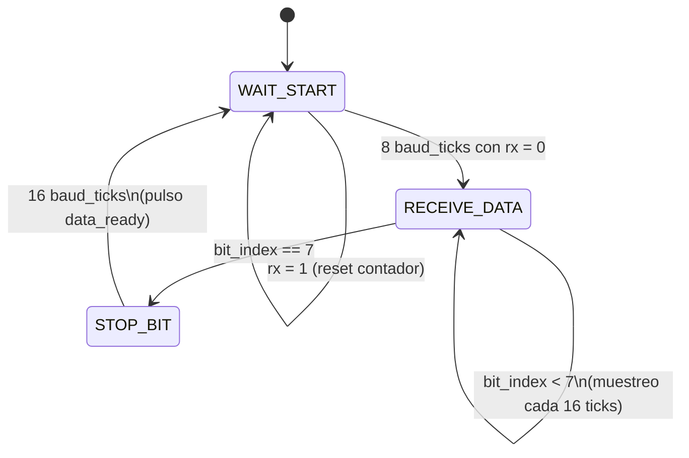
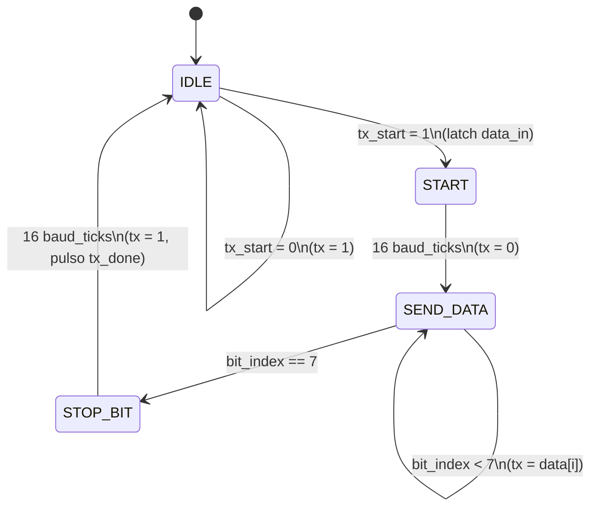

# UART (TX + RX) con interfaz a la ALU

Sistema de comunicación serie UART de 8N1 (8 bits de datos, sin paridad, 1 stop bit) acoplado a una ALU de 8 bits. La ALU calcula resultados que la interfaz despacha por el transmisor UART, y la cola de recepción guarda lo que llega por la línea serie.

## Arquitectura

```
                    +-----------+
                    |    ALU    |
                    +-----+-----+
                          |
                          v
   wr/rd  ----->  +---------------+   tx_start
                  |   interface   |-------------+
                  |  (FSM + FIFO) |             |
                  +-------+-------+             v
                          ^               +-----------+
                          |       data_in |    UART   |--> tx
                          | data_out      |  TX + RX  |
                          |     rx_done   |           |<-- rx
                          +-------------- +-----+-----+
                                                |
                                          +-----+-----+
                                          |  baud_gen |
                                          +-----------+
```

El módulo `UART` agrupa tres bloques: el `baud_rate_generator` que produce un tick a 16x la velocidad de baudios (oversampling), el `transmitter` y el `receiver`.

## Oversampling 16x

El `baud_rate_generator` divide la frecuencia del clock para producir un `baud_tick` a `16 * BAUD_RATE`. Esto permite muestrear cada bit en el medio (no en el flanco) y filtrar ruido en el bit de start.

Con `CLOCK_FREQ = 100 MHz` y `BAUD_RATE = 9600`:

```
DIVISOR = 100_000_000 / (9600 * 16) = 651
```

Cada bit dura `16 baud_ticks = 16 * 651 = 10416` ciclos de clock ≈ 104 µs.

## FSM del Receiver (3 estados)

El receptor es una máquina de estados finita que detecta el start bit por filtrado, recibe los 8 bits de datos y espera el stop bit.



| Estado          | Qué hace                                                                                    |
|-----------------|---------------------------------------------------------------------------------------------|
| `WAIT_START`    | Espera ver `rx = 0` durante 8 baud_ticks seguidos (mitad del start bit). Si `rx` vuelve a 1 antes, resetea el contador (filtro anti-ruido). |
| `RECEIVE_DATA`  | Muestrea el valor de `rx` cada 16 baud_ticks, guardando el bit en `shift_reg[bit_index]`. LSB primero. |
| `STOP_BIT`      | Espera 16 baud_ticks (duración del stop bit). Cuando termina, copia `shift_reg` a `data_out` y pulsa `data_ready` por un ciclo de clock. |

## FSM del Transmitter (4 estados)

El transmisor envía un frame completo cuando se le da el pulso `tx_start`. Latchea el dato y manda start + 8 bits + stop.



| Estado       | Qué hace                                                                                  |
|--------------|-------------------------------------------------------------------------------------------|
| `IDLE`       | `tx = 1`. Cuando llega `tx_start`, latchea `data_in` en `data_latch` y pasa a `START`.    |
| `START`      | `tx = 0` durante 16 baud_ticks (start bit).                                               |
| `SEND_DATA`  | Pone en `tx` el bit `data_latch[bit_index]` durante 16 baud_ticks. Avanza LSB a MSB.      |
| `STOP_BIT`   | `tx = 1` durante 16 baud_ticks (stop bit). Al final pulsa `tx_done` y vuelve a `IDLE`.    |

## Módulos del proyecto

| Archivo                     | Rol                                                                  |
|-----------------------------|----------------------------------------------------------------------|
| `top_system.v`              | Top de todo el sistema: instancia ALU + interface + UART             |
| `top_alu.v`                 | Top del subsistema ALU (con carga por switches/botones)              |
| `ALU.v`                     | ALU combinacional de 8 bits                                          |
| `interface.v`               | FSM de transmisión + FIFO de recepción entre ALU y UART              |
| `UART.v`                    | Wrapper de baud_gen + receiver + transmitter                         |
| `baud_rate_generator.v`     | Divisor de clock que genera `baud_tick` a 16x el baud rate           |
| `receiver.v`                | FSM de 3 estados que recibe un frame UART                            |
| `transmitter.v`             | FSM de 4 estados que envía un frame UART                             |

## Testplan implementado

Los tests están en `tb_uart.py` y se corren con `make`. Apuntan al módulo `UART` directamente. Para acelerar la simulación, el Makefile fuerza `BAUD_RATE = 1 MHz` con `CLOCK_FREQ = 100 MHz`, lo que deja 96 ciclos de clock por bit (un frame completo ~ 960 ciclos).

| Test                       | Qué verifica                                                                                  |
|----------------------------|-----------------------------------------------------------------------------------------------|
| `test_idle`                | Después del reset, `tx = 1` y `data_ready = 0` (la línea está idle).                          |
| `test_transmit`            | Envía `0x5A` por `tx_start` y verifica el frame (start + 0x5A LSB primero + stop) en `tx`.    |
| `test_transmit_zero`       | Edge case: envía `0x00`, todos los bits de datos quedan en 0.                                 |
| `test_transmit_all_ones`   | Edge case: envía `0xFF`, todos los bits de datos quedan en 1 (sólo el start bit es 0).        |
| `test_receive`             | Manejando un frame válido sobre `rx` con `0xA5`, verifica que `data_out` quede en `0xA5`.     |
| `test_tx_done_pulse`       | `tx_done` debe activarse exactamente 1 ciclo de clock al terminar una transmisión.            |
| `test_data_ready_pulse`    | `data_ready` debe activarse exactamente 1 ciclo de clock al terminar una recepción.           |
| `test_rx_noise_filter`     | Un glitch de menos de 8 baud_ticks en `rx` no debe procesarse como frame. Frame válido posterior sí. |
| `test_loopback`            | Conectando `tx` a `rx` por software, se envía `0xC3` y se verifica que se reciba `0xC3`.      |
| `test_loopback_multiple`   | Mismo loopback enviando `[0x55, 0xAA, 0x42, 0x91]` consecutivos; los 4 deben recibirse OK.    |
