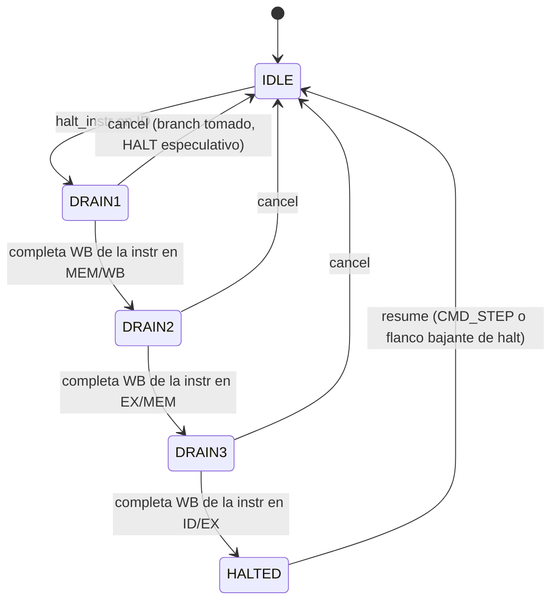

# Procesador RISC-V (RV32I) Pipeline de 5 Etapas

Implementación de un procesador RISC-V de 32 bits con pipeline clásico de 5 etapas (IF | ID | EX | MEM | WB), forwarding, detección de hazards, soporte para una instrucción HALT custom y una unidad de debug que se comunica con un host por UART.

## Etapas del pipeline

| Etapa  | Bloque         | Función                                                                    |
|--------|----------------|----------------------------------------------------------------------------|
| **IF** | `IF_Stage`     | Fetch desde BRAM dual-port. Usa `next_pc` combinacional como dirección para compensar la latencia de 1 ciclo de la BRAM. |
| **ID** | `ID_Stage`     | Decodifica todos los opcodes RV32I, lee el banco de registros (asíncrono, write-first desde WB) y genera el inmediato extendido en signo. |
| **EX** | `EX_Stage`     | ALU + muxes de forwarding + comparador de branch + cálculo de `branch_target`. Para JAL/JALR sobreescribe el resultado con `PC+4` (link). |
| **MEM**| `MEM_Stage`    | Memoria de datos (256 palabras, lectura combinacional, escritura síncrona). Solo LW/SW.|
| **WB** | `WB_Stage`     | Mux entre `alu_result` (ALU o link) y `mem_data` (LW) según `mem_to_reg`. |

## Hazards y forwarding

### Forwarding (`Forwarding_Unit`)
Selecciona el operando de la ALU desde el registro EX/MEM (1 ciclo atrás) o MEM/WB (2 ciclos atrás) cuando hay dependencias RAW, evitando stalls innecesarios. EX/MEM tiene prioridad sobre MEM/WB cuando ambos coinciden.

### Load-Use Stall (`Hazard_Unit`)
Cuando una instrucción `LW` en EX produce un valor que la instrucción siguiente (en ID) necesita inmediatamente, se inserta una burbuja:
- `stall` congela PC e IF/ID.
- `id_ex_flush` mete un NOP en ID/EX.
- En el siguiente ciclo el dato ya está disponible vía forwarding desde MEM/WB.

### Branch Flush
El branch se evalúa en EX, pero el redirect del PC se gatilla desde el registro EX/MEM (señal `mem_branch_taken`). Esto da una penalidad de **3 ciclos**: se flushean IF/ID, ID/EX y EX/MEM.

## Instrucción HALT custom

El opcode `7'b1111111` (instrucción `0x0000007F`) no está definido en RV32I y se reserva como HALT. El módulo `halt_detection_unit` detecta la HALT en ID y drena el pipeline antes de congelar todo, para que las instrucciones in-flight terminen su WB limpio.

Si un branch tomado llega mientras el HDU está drenando, significa que el HALT era especulativo (estaba después de un branch que sí se tomó), entonces el drain se cancela y se vuelve a `IDLE` sin congelar nada.

## Debug Unit y protocolo UART

`debug_unit` interpreta comandos enviados por UART desde un host (por ejemplo `debug_gui.py`). Comandos disponibles:

| Comando         | Código | Parámetros          | Respuesta            |
|-----------------|--------|---------------------|----------------------|
| `CMD_HALT`      | `0x01` | -                   | `ACK`                |
| `CMD_RUN`       | `0x02` | -                   | `ACK`                |
| `CMD_STEP`      | `0x03` | -                   | `ACK`                |
| `CMD_LOAD`      | `0x04` | addr (4B) + instr (4B) | `ACK`            |
| `CMD_RD_REG`    | `0x05` | reg (1B)            | data (4B)            |
| `CMD_RD_MEM`    | `0x06` | addr (4B)           | data (4B)            |
| `CMD_WR_MEM`    | `0x07` | addr (4B) + data (4B) | `ACK`              |
| `CMD_RESET`     | `0x08` | -                   | `ACK`                |
| `CMD_RD_IFID`   | `0x09` | -                   | 12B (PC, PC+4, INSTR) |
| `CMD_RD_IDEX`   | `0x0A` | -                   | 20B (PC, RS1, RS2, IMM, CTRL) |
| `CMD_RD_EXMEM`  | `0x0B` | -                   | 20B (PC+4, ALU, RS2, BTGT, CTRL) |
| `CMD_RD_MEMWB`  | `0x0C` | -                   | 16B (PC+4, ALU, MDATA, CTRL) |

`ACK = 0xAA`, `NACK = 0xEE`. Todas las palabras de respuesta se envían MSB primero.

## Estrategia de testing

El testbench (`tb_cpu.py`) apunta directamente contra `RISCV_Top`, **no contra `RISCV_Debug_Top`**, porque transmitir programas por UART a 9600 baud sobre 50 MHz toma ~5000 ciclos por byte, lo cual haría cada test absurdamente lento. En su lugar, manejamos las señales `debug_imem_we/addr/wdata`, `debug_halt`, `debug_rf_addr`, etc. directamente desde el testbench, como si fuéramos un debug_unit ideal. Esto permite correr cada programa en cientos de ciclos.

**Flujo de cada test:**

1. **Reset** del CPU con `debug_halt = 1` (queda congelado).
2. **Carga del programa**: secuencia de escrituras por `debug_imem_we` palabra por palabra.
3. **Release** de `debug_halt` para que el CPU empiece a ejecutar desde PC=0.
4. **Polling** sobre `halt_done_out` hasta que la instrucción HALT del programa termine de drenar el pipeline.
5. **Verificación** leyendo registros via `debug_rf_addr/rdata` y memoria via `debug_dmem_addr/rdata`.

Las instrucciones se codifican usando el módulo `riscv_instr.py` que viene con el proyecto, así los programas se leen como código RISC-V directo (sin tener que codificar a mano cada palabra).

## Testplan implementado

Los 17 tests cubren operaciones básicas, todos los tipos de inmediatos, los mecanismos del pipeline (forwarding, load-use stall, branch flush), todas las variantes de branch, saltos JAL/JALR, comportamiento de x0, y varios programas con bucles y memoria.

| Test                       | Programa                                                             | Resultado esperado |
|----------------------------|----------------------------------------------------------------------|---------------------|
| `test_basic_arithmetic`    | `x1=25, x2=17, x3=x1+x2, x4=x1-x2`                                   | `x3=42, x4=8`       |
| `test_logical_ops`         | `AND/OR/XOR` entre `0xF0` y `0x0F`                                   | `x3=0x00, x4=x5=0xFF` |
| `test_forwarding`          | 4 instrucciones con dependencias consecutivas, sin NOPs              | `x1=10, x2=15, x3=25, x4=15` |
| `test_load_use_stall`      | `SW; LW; ADD x3, x2, x2` — el LW dispara stall y forward MEM/WB      | `x2=0x42, x3=0x84`  |
| `test_branch_taken`        | `BLT 5,10,+8` salta sobre `ADDI x3,x0,99` — verifica centinela `x3=7`| `x3=7`              |
| `test_branch_not_taken`    | `BEQ 5,7,+8` no se toma — verifica que ejecute la siguiente          | `x3=42`             |
| `test_jal_jalr`            | Llamada a subrutina que calcula `x2*3` y retorna con JALR            | `x1=15, x10=12`     |
| `test_sum_loop`            | Bucle `1+2+...+10`                                                    | `x1=55`             |
| `test_fibonacci`           | `fib(10)` iterativo                                                   | `x2=55, x1=0`       |
| `test_memory_array`        | SW de 5 elementos en memoria, LW y suma                              | `x10=150, mem[0]=10, mem[16]=50` |
| `test_shifts`              | SLL/SRL/SRA con valor negativo + variantes SLLI/SRAI                 | `x6=0xFFFFFFFC, x7=0x3FFFFFFC, x9=0xFFFFFFFF` |
| `test_immediates`          | ADDI con `-1`, `-2048`, `+2047` (sign-extension) + ANDI/ORI/XORI     | `x1=0xFFFFFFFF, x2=0xFFFFF800, x3=2047` |
| `test_set_less_than`       | SLT/SLTU con `-1` vs `5`: signed da `1`, unsigned da `0`. + SLTI/SLTIU | `8 verificaciones`  |
| `test_lui_auipc`           | `LUI 0x12345 + ADDI 0x678` arma `0x12345678`; AUIPC suma PC al imm   | `x1=0x12345678, x2=0x1008, x3=12` |
| `test_all_branches`        | BNE, BGE, BLTU, BGEU — cada uno con centinela y veneno                | `x3=7, x4=8, x5=9, x6=6` |
| `test_zero_register`       | Intentar escribir a x0 (debe ignorarse), `ADD x0, x2, x2`            | `x0=0, x1=0`        |
| `test_gcd`                 | Euclides por restas: `gcd(48, 36)` con 2 paths y branch backward     | `x1=x2=12`          |